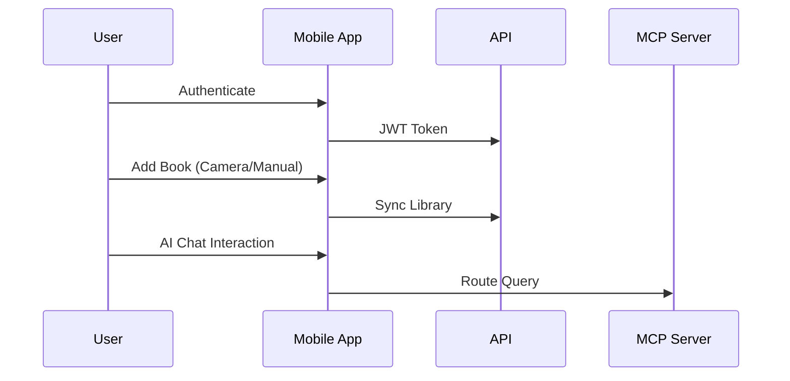

# Intellishelf Mobile Product Context

## Why This Project Exists
- Provide mobile access to Intellishelf bookshelf management system
- Enable on-the-go book management and AI interactions
- Complement web interface with native device capabilities

## Core User Problems Solved
1. Mobile-first access to personal library
2. Offline-first book management
3. Camera integration for ISBN scanning
4. Native device notifications for book updates

## Key User Flows

## Mobile-Specific Requirements
- MAUI multi-platform support (iOS/Android)
- Secure local credential storage
- Optimized for touch interactions
- Background sync with API
