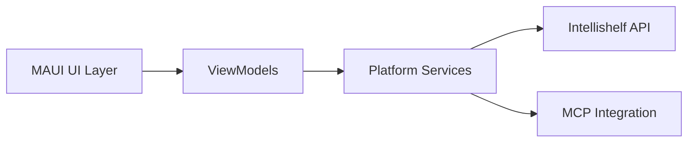

# Mobile System Architecture

## Core Components

## Key Patterns
1. MVVM Architecture
   - View-ViewModel separation using MAUI's data binding
   - ObservableObject for state management
   - Command pattern for user interactions

2. Dependency Injection
   - Service registration in MauiProgram.cs
   - Constructor injection for API clients
   - Platform-specific service implementations

3. API Communication
   - Refit for type-safe API clients
   - Exponential backoff retry policy
   - JWT authentication middleware

4. MCP Integration
   - MCP client initialization on app startup
   - Chat session management
   - Streaming response handling

## Critical Implementation Paths
- Book synchronization between local cache and API
- AI chat session state preservation
- Offline-first data strategies
